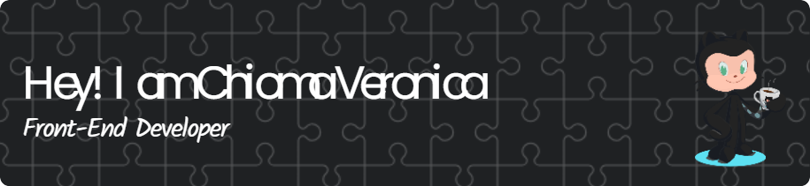

  
</h2>

 

<h2> About Me</h2>

I’m a Frontend Engineer who loves bringing ideas to life on the web. With skills in HTML, CSS, JavaScript, React, TypeScript, and Jest, I enjoy creating clean, user-friendly interfaces that make apps enjoyable to use. I focus on making sure everything works smoothly, looks great, and is easy to maintain. I’m always up for a challenge, whether it’s solving tough problems or learning something new, and I get a real kick out of building innovative solutions that make digital experiences better.

  
<h2>  Contact Me</h2>

  

    <i>You can reach out to me via</i>
    <a href="mailto:csusan894@gmail.com" style="textUnderline:none">
    Chioma Veronica
    </a>
  

